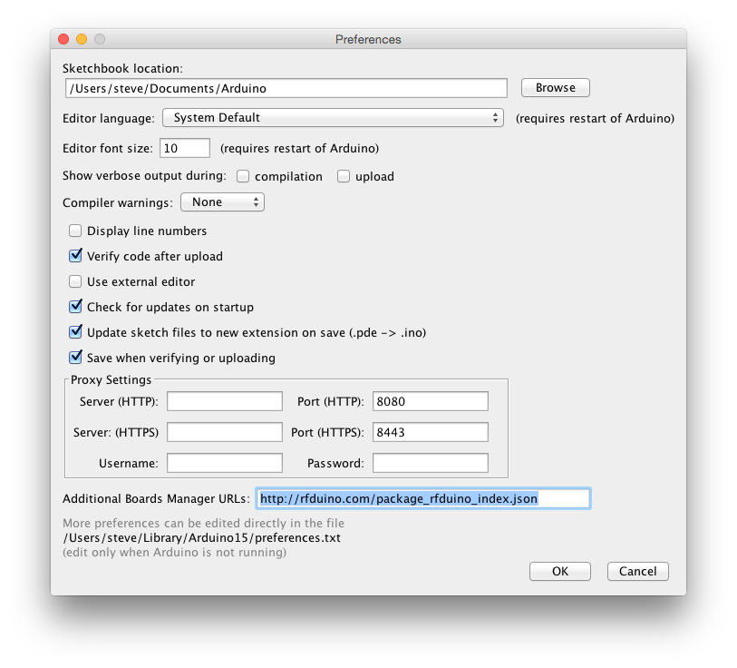

# RFduino: An Arduino shrunk to the size of a finger-tip and made wireless!


[Video](http://www.youtube.com/watch?v=arWBdGwCJcM)  

## Installation

* Get the [RFduino hardware](http://RFduino.com).

* Install the [FTDI drivers](http://www.ftdichip.com/Drivers/VCP.htm).

* Download [Arduino 1.6.3](http://arduino.cc/en/Main/Software) on newer.
  * _Mac OS X_: Requires Java 6 to be installed. Available [here](https://support.apple.com/kb/DL1572?locale=en_US).

* Open Arduino
  * edit preferences, and add rfduino.com as the Server (HTTP) under Proxy Settings and save.
      
  * Open the Boards Manager under Tools->Board menu.
  * Select the RFduino package at the end of the list, and click Install to install it.
  * Your new board will now show up in the Tools->Board menu.

Select the board and port, and you're ready to go!

Detailed instructions are available in our [Quick Start Guide](http://files.rfdigital.com/rfduino.quick.start.guide.pdf).

## Getting Started

* Attach the USB shield

* Select RFduino from the ```Tools/Board``` menu

* Select the port from the ```Tools/Port``` menu

* Select an example from the ```Files/Examples/RFduinoNonBLE``` or ```Files/Examples/RFduinoBLE``` directory

* Select ```Upload``` to compile, upload and execute the sketch

* Download the iPhone example apps from the iPhone App Store (search for ```RFduino```).
    * Detailed instructions for the Temperature app are available [here](http://files.rfdigital.com/rfduino.temperature.guide.pdf).
    * Detailed instructions for the ColorWheel app are available [here](http://files.rfdigital.com/rfduino.rgb.colorwheel.guide.pdf).

# Communicating with us

The best way to communiate with us is on the [RFduino Forum](http://forum.RFduino.com).
