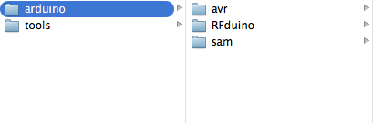

# RFduino: An Arduino shrunk to the size of a finger-tip and made wireless!


[Video](http://www.youtube.com/watch?v=arWBdGwCJcM)  

## Installation

* Get the [RFduino hardware](http://RFduino.com).

* Download [Arduino 1.5](http://arduino.cc/en/Main/Software).
  * _If you're on OSX_: Remember to open Arduino _first_ to make gatekeeper perform its magic!

* Copy the Arduino library into the appropriate directory for your system. (Folder should be named ```RFduino```, not ```RFduino-master```):
  
  * _Windows_:
    * ```C:\arduino-1.5.4\hardware\arduino```
  * _OSX, Arduino 1.5.8_:
    * ```/Applications/Arduino.app/Contents/Resources/Java/hardware/arduino```

* Install the [FTDI drivers](http://www.ftdichip.com/Drivers/VCP.htm).

You're ready to go!

Detailed instructions are available in our [Quick Start Guide](http://files.rfdigital.com/rfduino.quick.start.guide.pdf).

## Getting Started

* Attach the USB shield

* Select RFduino from the ```Tools/Board``` menu

* Select the port from the ```Tools/Port``` menu

* Select an example from the ```Files/Examples/RFduinoNonBLE``` or ```Files/Examples/RFduinoBLE``` directory

* Select ```Upload``` to compile, upload and execute the sketch

* Download the iPhone example apps from the iPhone App Store (search for ```RFduino```).
    * Detailed instructions for the Temperature app are available [here](http://files.rfdigital.com/rfduino.temperature.guide.pdf).
    * Detailed instructions for the ColorWheel app are available [here](http://files.rfdigital.com/rfduino.rgb.colorwheel.guide.pdf).

# Communicating with us

The best way to communiate with us is on the [RFduino Forum](http://forum.RFduino.com).

### A Lot More Coming!

We are working on documentation as fast as we can.  Until then, the best source for documentation is the sketch examples.

This project has been a huge success, and we have many exciting things planned that we want to share with the community.  At the same time, we are unbelievable busy, with a ton going on and lots of small items to clean up.  We are just a small team working on this project ... please bear with us!

We hope you enjoy creating stuff with your RFduino as much as we do!

The RFduino team.
